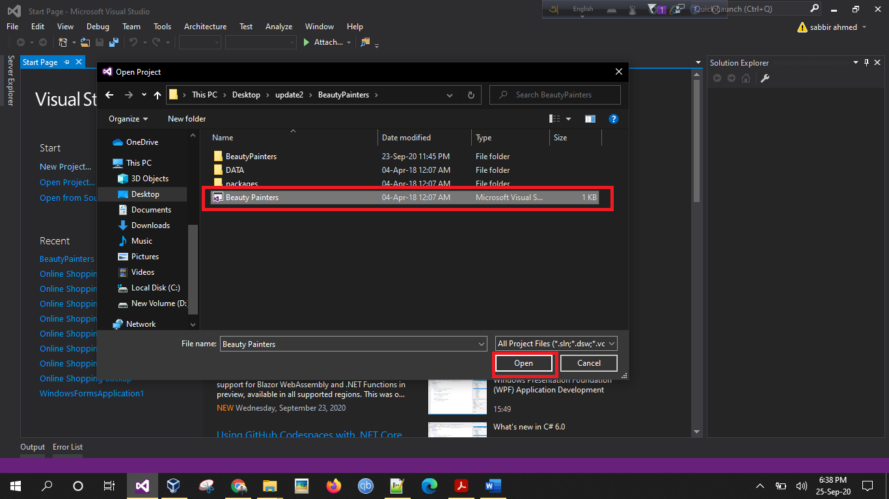

# BeautyPainters
BeautyPainters is website where you can find various makeup iteams.Go, visit & Buy.

### What does this do?
This is a [ASP.net][asp] and Sql server based platform.Main goal is to provide a user,admin experince to run a online based shopping platform.Here Makeup based iteams are sold.Boh user,Admin & their corresponding parts are being handled here.

### Project Features:
	 * User & Admin Login
  
	 * Admin Panel: its allows to add Admin, Update,Insert & Delete Product
	   Show user Database,List of Purchased Products ,customers and their details.
     
	 * Products are shown accoring to their Offers.The product with best offer is displayed in home.
  
	 * User Panel : User can logout and login later but their CART will not be changed.When user press PLACE ORDER, only when order is placed.
     
	 * User can Login/Website can get addition info from Facebook/ twitter/Gmail.User can also commment/Share the product through FB as well.
     
	 * CART part is done user friendly. User can customize their cart product add/ delete product as they want. Place order, Give locations, See previous orders as well.
 
### Some ScreenShots of Website

	
 
	

<!-- AUTO-GENERATED-CONTENT:START (TOC:collapse=true&collapseText="Click to expand") -->

	

  

  

  

<!-- AUTO-GENERATED-CONTENT:END -->	

### Future Wroks

    * Add more dynamic fealtures & make it more responsive as possible.
    * Use Sceams to be more dynamic.
    * Add mobile verification of customers.
    * Online Payement.
---
### Setup to run the project
<!-- AUTO-GENERATED-CONTENT:START (TOC:collapse=true&collapseText="Click to expand") -->

	
It is encouraged to use latest version of Visual Studio & use SQL Server Management Studio 12

1.  Clone or download this repo.
2.  Now Open Visual Studio. File -> Open -> Project Solution

   
   

3. Select Solution file  .Open

    
       

4. Now open SSMS ( SQL SERVER MANAGEMENT STUDIO) . Connect to your Database engine. Add the SQL **Shopping.mdf & Shopping.ldf** given in SQL folder. 
   Copy Data base Server name 
   

   
      

5. Now open Server Explorer .Under Data connection  X  means not connected. So delete it.  
   

   
      

6. Now click the Set new connection icon. Give server name  & database name 
    

    
       

7. Connection is green now. Means its connected successfully.  
     

     
        

8.  Now go to **Project->Settings->BeautyPainter Settings** :  Type Choose :Connection String. Now using the button give  
    Server name  & database again. Click ok.  A Connection string is provided there.     
    

    
       

 9.  Final Step. Now Go to **Solution Explorer-> Web Config.** Chanage accordingly to your server name in the following line .
    

   
       

 10. You are Good to go. Run the project in yur default browser.
 

<!-- AUTO-GENERATED-CONTENT:END -->

---
### Software & Tools Used To Make Beauty Painters
[][html]
[][css]
[][database]
[][aspi]

[aspi]: https://github.com/sabbirahmedAUST/BeautyPainters/tree/master/image/aspi.png
 [database]: https://github.com/sabbirahmedAUST/BeautyPainters/tree/master/image/database.png
[asp]: https://dotnet.microsoft.com/apps/aspnet 
[html]: https://raw.githubusercontent.com/github/explore/80688e429a7d4ef2fca1e82350fe8e3517d3494d/topics/html/html.png
[css]: https://raw.githubusercontent.com/github/explore/80688e429a7d4ef2fca1e82350fe8e3517d3494d/topics/css/css.png
